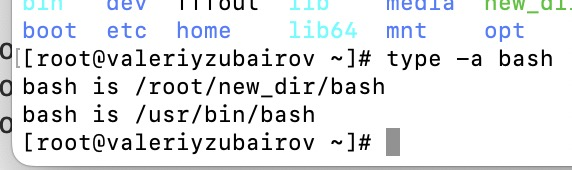

# Основы терминала

1. какой переменной можно задать длину журнала history, и на какой строчке manual это описывается?
что делает директива ignoreboth в bash?
* Ответ: HISTFILESIZE, 909 строка
* ignoreboth не сохраняет в истории строки, которые начинаются с пробела, или строки, которые равны пред-ей.
2. В каких сценариях использования применимы скобки {} и на какой строчке man bash это описано?
* Ответ: 311 строка. Для описания списокв в команде
3. С учётом ответа на предыдущий вопрос, как создать однократным вызовом touch 100000 файлов? Получится ли аналогичным образом создать 300000? Если нет, то почему?
* Ответ: На touch f{1..100000}.txt ругнулся, что список аргументов слишком длинный. getconf ATG_MAX выдал 1048576. Кажется, что у меня даже 100К не вариант :)

4. В man bash поищите по /\[\[. Что делает конструкция [[ -d /tmp ]]
* Ответ: команда, которая проверяет, является ли /tmp директорией

5. Сделайте так, чтобы в выводе команды type -a bash первым стояла запись с нестандартным путем, например bash is ... Используйте знания о просмотре существующих и создании новых переменных окружения, обратите внимание на переменную окружения PATH
```
bash is /tmp/new_path_directory/bash
bash is /usr/local/bin/bash
bash is /bin/bash
```
(прочие строки могут отличаться содержимым и порядком) В качестве ответа приведите команды, которые позволили вам добиться указанного вывода или соответствующие скриншоты.
* Ответ: mkdir new_bash \
copy /usr/bin/bash ~/new_dir/ \
export PATH=~/new_dir:/usr/local/sbin:/usr/local/bin:/usr/sbin:/usr/bin:/root/bin \
type -a bash


6. Чем отличается планирование команд с помощью batch и at?
* Ответ: at – выполнение одного задания в заданное время, batch - выполнение задание, когда загрузка упадет ниже 0.8